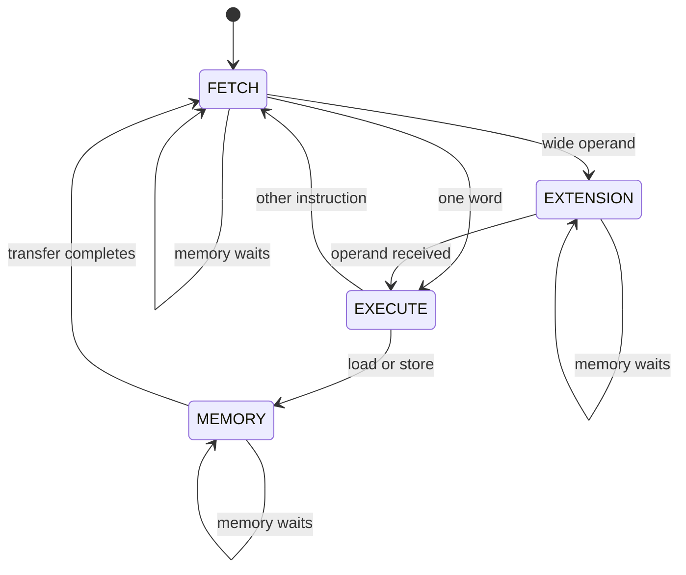

# From your 8-bit CPU to a 16-bit CPU

This guide follows the actual source in your August 30 CPU8 archive. Open
`baseline/cpu8_core.v` beside `rtl/cpu16_core.v`, and the corresponding ALU
files, as you read. `cpu8-to-cpu16.diff` also shows the complete RTL changes.

## 1. What “16-bit CPU” means here

The arithmetic unit and general-purpose registers now operate on 16 bits at a
time. That lets a single ADD handle values from 0 to 65,535, or two's-complement
values from −32,768 to 32,767. The same bits support both interpretations;
ADD itself does not know whether you intended a signed or unsigned value.

Your original CPU already used 16-bit **instructions**, despite having an
8-bit **datapath**. These widths describe different things. A command can need
16 bits to specify an operation and its operands while processing 8-bit values.

| Part | Original CPU8 | This CPU16 | Why it matters |
|---|---|---|---|
| ALU inputs/result | 8 bits | 16 bits | Arithmetic and logic process wider values |
| Registers | 8 × 8 bits | 8 × 16 bits | Holds larger values; still R0–R7 |
| Register index | 3 bits | 3 bits | Eight registers still need only three index bits |
| PC | 8 bits | 16 bits | Instruction address range expands |
| Instruction bus | 16 bits | 16 bits | Reuses original first-word format |
| Instruction length | Always 1 word | 1 or 2 words | Second word carries full-width operand |
| Data bus | 8 bits | 16 bits | Load/store a whole 16-bit word |
| Data address | 8 bits | 16 bits | Addresses 65,536 words |
| Opcode | 4 bits | 4 bits | Same 16 operations |
| Flags | Z only | Z, N, C, V | Carry and overflow make multi-word math, signed and unsigned compares possible |
| Memory timing | Always available | Valid/ready | Can wait for a memory response |
| Controller | One edge per instruction | Multicycle FSM | Separates fetch, decode/execute, and data access |
| Clock target | 20 MHz | 20 MHz initial target | Physical verification still determines feasibility |

Do not mechanically replace every `7:0` with `15:0`: some fields stay narrow,
and the instruction encoding needs a deliberate redesign.

## 2. Widen the datapath

Your old ALU contained:

```verilog
input wire [7:0] a, b;
output reg [7:0] y;
```

The new ALU changes these to `[15:0]`. The operations remain `a + b`, `a - b`,
`a & b`, `a | b`, `a ^ b`, and `b` for MOV. Verilog builds wider combinational
logic from the wider signals. Constants and the zero comparison are also
explicitly 16 bits.

The original and new results for `0x00FF + 1` show the difference:

| Width | Stored result | Z |
|---|---|---|
| 8 bits | `0x00` | 1 |
| 16 bits | `0x0100` | 0 |

At the new boundary, `0xFFFF + 1` becomes `0x0000`. The extra carry is discarded
because y is only 16 bits. Similarly, `0x0000 - 1` becomes `0xFFFF`.

Widening alone does not create a carry flag. The first CPU16 delivery kept only Z
and could not express many real programs. The v2 ISA (section 12) adds a carry flag
from a 17-bit sum, a negative flag, a signed-overflow flag, and instructions that use
them (ADC, SBC, conditional branches).

## 3. Widen storage and keep R0 correct

The register file becomes:

```verilog
reg [15:0] regs [0:7];
```

The first range is the width of each register; the second selects eight
registers. Each source is selected with a 3-bit register index. Reads of R0
explicitly return zero, writes to R0 are suppressed, and reset initializes
the register file. R0's behavior is part of the instruction set, not a
programming convention.

Writes use nonblocking assignments (`<=`) inside a clocked block. On an ADD
edge, the ALU sees the old register values; the destination changes after
the clock event. This models flip-flops. Combinational ALU/decode logic uses
blocking assignments (`=`) and sets defaults to avoid unintended latches.

Keep the reset. Ordinary ASIC registers do not start at zero merely because a
simulation initializes them. The CPU expects reset after power-up.

## 4. Fit a 16-bit operand into the instruction stream

An opcode uses 4 bits and rd uses 3. Adding a 16-bit immediate needs at least
23 bits, more than a single 16-bit instruction word can hold.

We keep the first instruction word and use its previously unused bit 8 as a
wide-operand marker **for immediate/address operations only**. If that bit is
1, the CPU reads the next 16-bit word as the operand. Register/register
operations still use bits [8:6] for rs, so their bit 8 is not a marker.

For `LDI R1, 0x1234`:

1. Opcode LDI = 1, contributing `0x1000`.
2. R1 in bits [11:9] contributes `1 << 9 = 0x0200`.
3. Wide marker bit 8 contributes `0x0100`.
4. The first word is `0x1300`; the second is `0x1234`.

Conditional branches (section 12) always take a second word for the target.
The instruction bus never becomes 32 bits wide. The CPU reads two successive
words through the same 16-bit bus. A small `LDI R1, 5` remains `0x1205`.

The assembler decides instruction sizes in its first pass, records labels,
then emits machine words in its second pass. Label references default to the
wide form so a forward label's unknown value cannot change an earlier
instruction's size and invalidate later labels. You can request `.S` when
you intentionally need an address under 256.

## 5. Add a controller that can wait

The original CPU directly decoded `imem_rdata` and completed each instruction
on one clock edge. It assumed both memories responded combinationally within
that cycle. A second instruction word and variable memory latency need state.

The new controller has four states:



HALT sets `halted`, which freezes the state machine and suppresses requests
until reset. It is a flag rather than a fifth encoded state.

- **FETCH:** request instruction at PC. On acceptance, latch opcode/register
  fields, remember the instruction's address, and increment PC.
- **EXTENSION:** request the next word. On acceptance, latch the full operand
  and increment PC again.
- **EXECUTE:** perform arithmetic, update flags, or choose a branch target.
  A load/store proceeds to MEMORY without prematurely updating registers.
- **MEMORY:** hold a data request until acceptance. A load writes its register
  and Z on completion; a store completes without changing Z.

The `instruction` register stores only bits [15:6], which contain opcode and
register fields. The immediate has its own 16-bit `operand` register. Storing
unused instruction bits would add no behavior and synthesis would remove them.

For a wide LDI at address 0 with no waits:

| Rising edge | State before edge | What is accepted or changed |
|---|---|---|
| 1 | FETCH | Accept `1300`; save instruction address 0; PC becomes 1 |
| 2 | EXTENSION | Accept `1234`; operand becomes `1234`; PC becomes 2 |
| 3 | EXECUTE | R1 becomes `1234`, Z becomes 0 |
| 4 | FETCH | Accept next instruction at address 2 |

Notice that the register is not written during the extension fetch. Separating
the steps makes the data available before the execution edge.

## 6. Understand the handshake and the reset fix

The CPU asserts valid to request work. Memory asserts ready when the transfer
can finish. Only a rising edge with both signals high counts as a transfer.
If ready remains low for five cycles, the CPU holds one request for five
cycles. It does not execute five instructions or store the value five times.

Your original store logic checked `!halted` and the store opcode, but did not
check `rst_n`. External memory could therefore see write-enable on a reset
edge. The new write-enable requires a valid memory request, and valid is
gated by reset. The reset test deliberately interrupts a stalled store and
checks that it has not committed.

Reset cannot undo a store that already completed before reset. The external
memory controller must discard canceled requests too; see `INTERFACE.md`.

## 7. Widen addresses and define the memory unit

The PC and data addresses now have 16 bits. With 65,536 addresses and two bytes
per word, each fully implemented address space holds 128 KiB. Instruction and
data memory are separate, so an instruction at address `0x8000` is not the same
storage location as data address `0x8000`.

The address range is an interface capability, not memory that exists inside
the core. Connecting only a smaller RAM requires a documented address decoder
or fault policy. Silently throwing away upper address bits creates aliases.

For hardware integration, choose actual SRAM/ROM or a memory bridge and provide
a way to load the program before releasing reset. Testbench `$readmemh` calls
do not create power-up contents in a fabricated SRAM.

## 8. Trace a useful program

The demo performs these steps:

```asm
LDI R1, 0x1234
LDI R2, 0x0102
ADD R1, R2
ST R1, [0x8000]
LD R3, [0x8000]
CMP R1, R3
JNZ fail
```

R1 becomes `0x1336`. ST sends that word to a high address that CPU8 could not
represent. LD reads it into R3. CMP compares all 16 bits and sets Z=1. JNZ
is not taken because the values match.

The next loop initializes R4 to 5, then repeatedly executes `ADDI R4, -1`.
Here −1 is `0xFFFF`. Adding it modulo 65,536 reduces R4 by one. Once the result
is zero, Z becomes 1 and JNZ falls through. The success marker is then stored.

## 9. Know where compatibility ends

The exact original CPU8 smoke program runs successfully on this CPU16. That
checks a useful common subset; it is not a promise that every old program
has identical behavior.

- CPU8 overflowed at 255; CPU16 overflows at 65,535. Branches based on overflow
  producing zero can change behavior.
- A short immediate `0xFF` now means +255. It is not −1 in a 16-bit register.
  Use the wide value `0xFFFF` for −1.
- Old immediate words with ignored bit 8 set now request an extension word.
  Canonical old encodings had that bit zero.
- Opcode 0 is no longer just NOP: `0000` is still NOP, but other function codes
  now select new instructions (section 12).
- CMP, ADD, SUB and ADDI now also set C, N and V. Z behaves exactly as before.
- Data addresses identify 16-bit words instead of 8-bit bytes.
- PC wraps at 65,535 rather than 255.
- Execution takes multiple cycles and uses new memory handshakes.

## 10. What the verification proves

Read `docs/VERIFICATION.md` for the full picture. In short:

- A Python reference model executes every instruction independently of the RTL
  (flags come from ordinary integer arithmetic, not from a copy of the hardware adder).
- Real programs (multiply, recursion, sorts, CRC-16, 32-bit math, every branch
  condition) have their results computed again in plain Python, and the model must agree.
- The RTL then runs about 40 programs, including programs with random bits in every
  field the ISA calls "ignored", random branchy programs, and whole-memory random
  instruction soup. After every instruction the testbench checks PC, flags and registers,
  and on the ports it checks every fetch, load and store, in order.
- Each program runs against four memory behaviours: always ready, random ready with
  garbage data while not ready, a registered SRAM with one-cycle latency, and long bursty waits.
  With no waits the cycle count of every instruction is checked exactly.
- Random resets are injected mid-program; the CPU must cancel pending requests and restart from zero.
- The same programs run on the synthesized gate-level netlist using only the ports.
- A mutation test injects 61 plausible bugs one at a time. A regression that cannot
  fail proves nothing, so every mutant must be caught.

This is substantial functional testing, but not formal proof, fault coverage, or
physical signoff. It cannot show the chip meets 20 MHz after routing or that its layout
satisfies foundry rules.

## 11. Connect the RTL work to tapeout

Synthesis maps RTL into cells. Floorplanning allocates space and power routing.
Placement chooses cell locations. Clock-tree synthesis distributes the clock.
Routing connects the cells. Parasitic extraction estimates wire resistance and
capacitance; timing analysis then checks setup and hold with those effects.
Layout generation produces GDS for physical verification and integration.

The wider datapath adds storage and logic, and longer carry paths can affect
timing. Keeping a 20 MHz target does not establish that the target is met.
Also, a multicycle CPU at 20 MHz does fewer than 20 million instructions per
second: simple one-word instructions take at least two cycles, wide operations
three, and memory instructions one more. Wait states add further cycles.

The next meaningful step is to run the supplied ORFS configuration in your
working environment, inspect its reports, and integrate the core into your
chosen shuttle's top-level design. Follow `TAPEOUT.md`.

## Practice tasks

1. Predict R1 and Z after `LDI R1, 0xFFFF; ADDI R1, 1`. Check your answer in a trace.
2. Encode `LDI R3, 0xABCD` by hand, then compare to the assembler listing.
3. Add a program that stores and reloads `0x8000` at address `0xFFFF`.
4. Explain why a two-cycle SRAM needs ready low before its response is available.
5. Group 0 still has reserved function codes (0x0E, 0x0F, 0x20-0x3F). Pick one for a
   new instruction such as `NEG`, write its encoding, flag rules and boundary tests,
   add it to the model, the RTL and `tools/progs.py`, and watch `make mutate` for holes.
6. Trace `CALL f` / `RET` by hand: what is in R7 after the call, and which cycle writes it?
7. Write a 32-bit negate (two's complement) using `NOT` and `ADC`.

Answers to the first two: R1=`0000`, Z=1 (and now C=1); the LDI words are `1700 ABCD`.

## 12. The v2 ISA: making it express real programs

Version 1 had one flag, no subroutines, no indirect addressing and no shifts. Those limits mean
you cannot index an array, call a function, compare signed numbers or add 32-bit values.
All 16 opcodes were in use, so v2 turns opcode 0 into a **group**: `0000` is still NOP, and the
low six bits of other opcode-0 words are a function code (`docs/ISA.md` has the table).

What was added and what it enables:

| Addition | Needed for |
|---|---|
| C, N, V flags; carry from a 17-bit sum | unsigned/signed compare, multi-word math |
| `ADC`, `SBC` | 32-bit and wider arithmetic: `ADD lo` then `ADC hi` |
| `SHL SHR SAR RCR NOT` | multiply, CRC, bit fields, 32-bit shifts |
| 14 conditional branches (`BEQ BNE BHS BLO BHI BLS BGE BLT BGT BLE BMI BPL BVS BVC`) | loops and `if` on any comparison |
| `LDX`, `STX` | arrays, pointers, copying, sorting |
| `PUSH`, `POP` (default stack pointer R6) | local data and recursion |
| `BAL`/`CALL` with a link register, `JR`/`RET`, `JALR` | subroutines, jump tables, function pointers |

Worked example, 32-bit add (`R5:R6 = R1:R2 + R3:R4`):

```asm
MOV R5, R1      ; high
MOV R6, R2      ; low
ADD R6, R4      ; low add sets C
ADC R5, R3      ; high add consumes C
```

Why C means "no borrow" after a subtract: `a - b` is computed as `a + ~b + 1`, so a carry out of bit 15
means `a >= b` (unsigned). That is why `BHS` branches on C and why `SBC` subtracts `1 - C`.

`CALL f` is a conditional-branch word with condition "always" and link register R7:
the CPU writes the address of the next instruction into R7, then jumps. `RET` is `JR R7`.
A function that calls another must save R7 first (`PUSH R7`, `POP R7`) or the first return address is lost.
`programs/recursion.asm` does exactly this.

One design decision worth noticing: `PUSH` pre-decrements and `POP` post-increments, so R6 always points at
the most recently pushed value. If you `POP R6` the loaded value wins over the increment, a rule written
into the ISA and tested in `corner_cases.asm`, because hardware and model must agree on every such corner.
